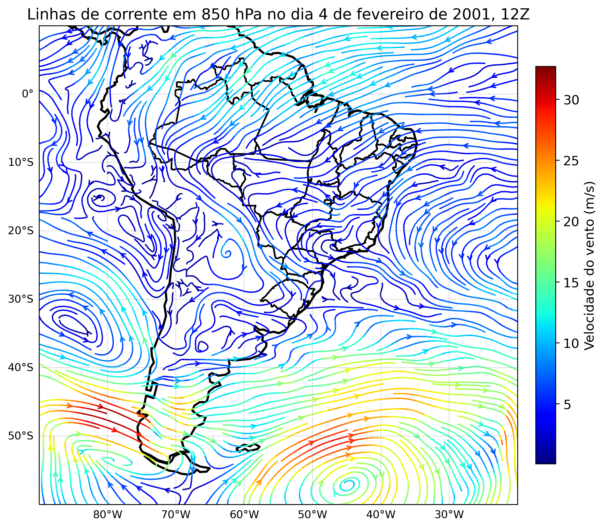
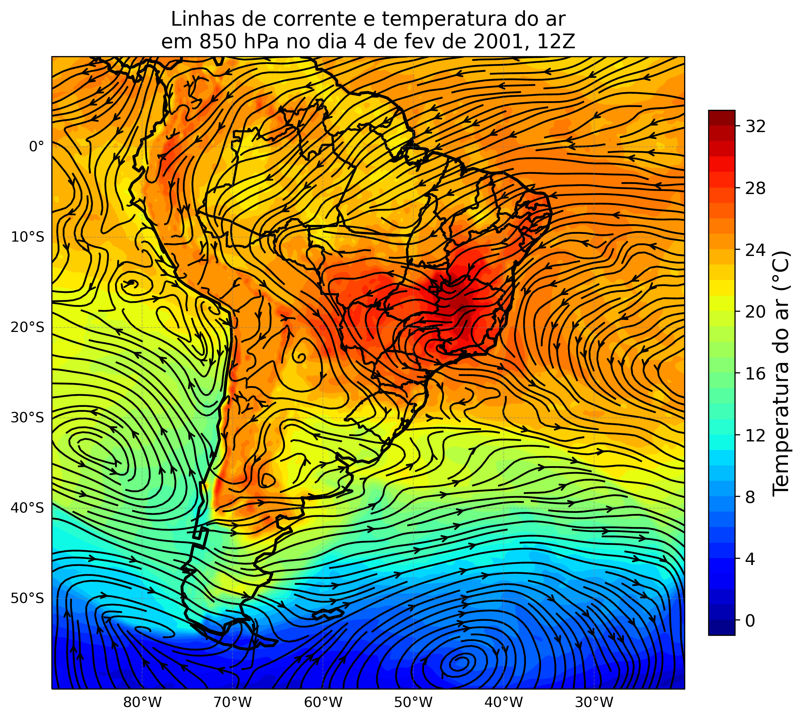
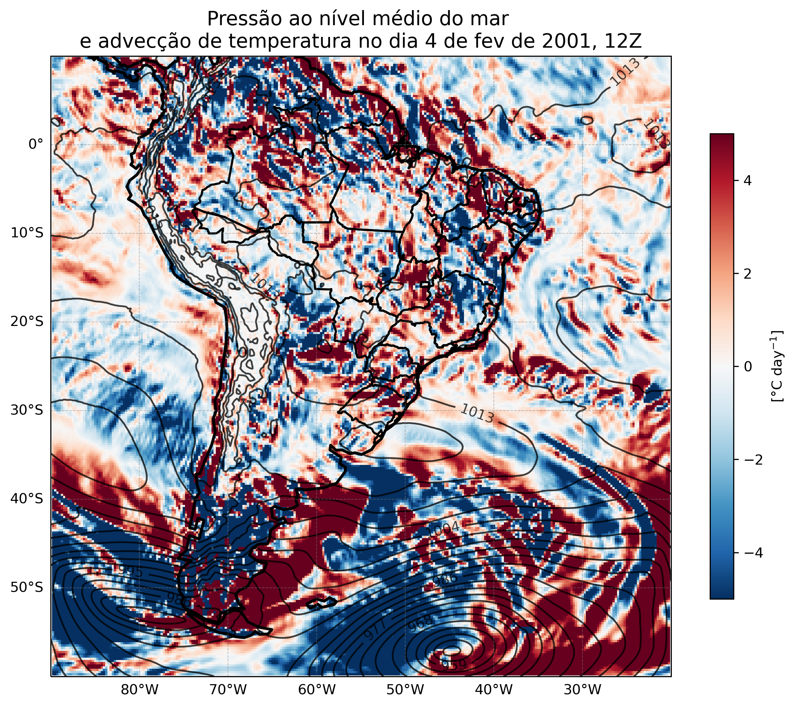
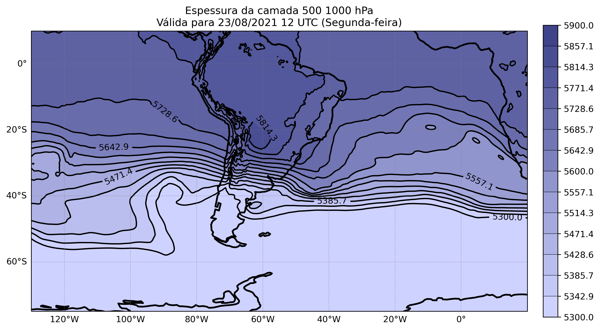

# Plotagem de campos sinóticos com Python e dados do ERA5

Esse script plota alguns campos sinóticos para a região da América do Sul, utilizando dados de reanálise do ERA5.

- A advecção de temperatura foi baseado no repositório 'davidmnielsen/mygrads'.
- A figura da espessura da camada 500-1000 hPa foi inspirada nas antigas figuras do CPTEC.

```python
import numpy as np
import xarray as xr
import matplotlib.colors as colors
import matplotlib.colorbar as colorbar
import matplotlib.pyplot as plt
import cartopy.crs as ccrs
import cartopy.feature as cfeature
```


```python
ds = xr.open_dataset('u_v_850hpa.nc')
u = ds['u']
v = ds['v']
lon, lat = np.meshgrid(u.longitude, u.latitude)
vel = np.sqrt(u**2 + v**2)
# vel = ds['vel']
time = ds['time']

fig = plt.figure(figsize=(10, 8))
ax = plt.axes(projection=ccrs.PlateCarree())
ax.set_extent([-90, -20, -60, 10], ccrs.PlateCarree())
# ax.add_feature(cfeature.BORDERS, color='black', linewidth=2)
ax.add_feature(cfeature.COASTLINE, color='black', linewidth=2)
ax.add_feature(cfeature.STATES.with_scale('50m'), linewidth=1.5)
# ax.add_feature(cfeature.OCEAN, facecolor='lightblue')
# ax.add_feature(cfeature.LAKES, alpha=1.0)
# ax.add_feature(cfeature.LAND, facecolor='lightgray')

gd = ax.gridlines(crs=ccrs.PlateCarree(), linestyle='--', color='gray', draw_labels=True, alpha=0.5, linewidth=0.5)
gd.right_labels = False
gd.top_labels = False

stream = ax.streamplot(lon, lat, u.isel(time=0), v.isel(time=0), color=vel.isel(time=0).values,
                        cmap='jet', linewidth=1.25, density=3, arrowsize=1, arrowstyle='->', transform=ccrs.PlateCarree())

ax.set_title('Linhas de corrente em 850 hPa no dia 4 de fevereiro de 2001, 12Z', size=14)
cbar = fig.colorbar(stream.lines, ax=ax, pad=0.03, fraction=0.033)
cbar.set_label(label='Velocidade do vento (m/s)', size=12)
cbar.ax.tick_params(labelsize=12)

plt.savefig('imagens/streamplot_wvwd.png', dpi=300, bbox_inches='tight')
plt.show()
```  



    


```python
ds_t = xr.open_dataset('temperature_850hpa.nc')
t = ds_t['t'] - 273.15
ds = xr.open_dataset('u_v_850hpa.nc')
u = ds['u']
v = ds['v']
lon, lat = np.meshgrid(u.longitude, u.latitude)
vel = np.sqrt(u**2 + v**2)
# vel = ds['vel']
time = ds['time']

fig = plt.figure(figsize=(10, 8))
ax = plt.axes(projection=ccrs.PlateCarree())
ax.set_extent([-90, -20, -60, 10], ccrs.PlateCarree())
# ax.add_feature(cfeature.BORDERS, color='black', linewidth=2)
ax.add_feature(cfeature.COASTLINE, color='black', linewidth=2)
ax.add_feature(cfeature.STATES.with_scale('50m'), linewidth=1.5)
# ax.add_feature(cfeature.OCEAN, facecolor='lightblue')
# ax.add_feature(cfeature.LAKES, alpha=1.0)
# ax.add_feature(cfeature.LAND, facecolor='lightgray')

gd = ax.gridlines(crs=ccrs.PlateCarree(), linestyle='--', color='gray', draw_labels=True, alpha=0.5, linewidth=0.5)
gd.right_labels = False
gd.top_labels = False

im = ax.contourf(lon, lat, t.isel(time=0), 
                 levels=np.arange(int(t.min().values)-1, int(t.max().values)+2, 1), cmap='jet',
                 transform=ccrs.PlateCarree())

# isolinhas = ax.contour(lon, lat, t.isel(time=0), 
#                  levels=np.arange(int(t.min().values)-1, int(t.max().values)+2, 1), colors='black',
#                  transform=ccrs.PlateCarree())

stream = ax.streamplot(lon, lat, u.isel(time=0), v.isel(time=0), color='black',
                        cmap='jet', linewidth=1.25, density=3, arrowsize=1, arrowstyle='->', transform=ccrs.PlateCarree())

cbar = plt.colorbar(im, ax=ax, pad=0.03, fraction=0.033)
cbar.set_label(label='Temperatura do ar (°C)', size=15)
cbar.ax.tick_params(labelsize=12)

ax.set_title('Linhas de corrente e temperatura do ar\nem 850 hPa no dia 4 de fev de 2001, 12Z', size=14)

plt.savefig('imagens/streamplot_850_shaded.png', dpi=300, bbox_inches='tight')
plt.show()
```



    


```python
ds = xr.open_dataset('surface_pressure_MSL.nc')
ds['msl'] = ds['msl'] / 100
sp = ds['msl']
# lon, lat = np.meshgrid(sp.longitude, sp.latitude)

time = ds['time']

import sys
sys.path.append('/media/lucas/DADOS HITACHI/Scripts para o github/campos_sinoticos/mygrads')
import mygrads as mg

ds_t = xr.open_dataset('temperature_850hpa.nc')
ds_t['t'] = ds_t['t'] - 273.15
ds_uv = xr.open_dataset('u_v_850hpa.nc')

lat = ds['latitude'].values
lon = ds['longitude'].values
u = ds_uv['u'][0,:].values
v = ds_uv['v'][0,:].values
t = ds_t['t'][0,:].values
np.shape(t)
tadv = mg.hadv(u,v,t,lat,lon)


fig = plt.figure(figsize=(10, 8))
ax = plt.axes(projection=ccrs.PlateCarree())
ax.set_extent([-90, -20, -60, 10], ccrs.PlateCarree())
ax.add_feature(cfeature.COASTLINE, color='black', linewidth=2)
ax.add_feature(cfeature.STATES.with_scale('50m'), linewidth=1.5)
mesh = ax.pcolormesh(lon, lat, tadv*86400, vmin=-5,vmax=5, transform=ccrs.PlateCarree(), cmap="RdBu_r")
cbar=plt.colorbar(mesh, shrink=0.75,label='[°C day$^{-1}$]')

# fig = plt.figure(figsize=(10, 8))
# ax = plt.axes(projection=ccrs.PlateCarree())
# ax.set_extent([-90, -20, -60, 10], ccrs.PlateCarree())
# # ax.add_feature(cfeature.BORDERS, color='black', linewidth=2)
# ax.add_feature(cfeature.COASTLINE, color='black', linewidth=2)
# ax.add_feature(cfeature.STATES.with_scale('50m'), linewidth=1.5)
# # ax.add_feature(cfeature.OCEAN, facecolor='lightblue')
# # ax.add_feature(cfeature.LAKES, alpha=1.0)
# # ax.add_feature(cfeature.LAND, facecolor='lightgray')

gd = ax.gridlines(crs=ccrs.PlateCarree(), linestyle='--', color='gray', draw_labels=True, alpha=0.5, linewidth=0.5)
gd.right_labels = False
gd.top_labels = False

levels = np.arange(int(sp.min().values)-1, int(sp.max().values)+1, 3)

im = ax.contour(lon, lat, sp.isel(time=0), 
                 levels=levels, colors='black', alpha=0.75, linewidths=1.25,
                 transform=ccrs.PlateCarree())


# Adiciona os rótulos das isóbaras
labels = ax.clabel(im, inline=1, fontsize=10, levels=levels[::3])

ax.set_title('Pressão ao nível médio do mar \ne advecção de temperatura no dia 4 de fev de 2001, 12Z', size=14)

plt.savefig('imagens/advT_850_msl.png', dpi=300, bbox_inches='tight')
plt.show()
```



    


```python
import matplotlib.colors as mcolors

ds = xr.open_dataset('geopotential_2021-08-23.nc')
ds['hgpt'] = ds['z'] / 9.80665
#selecionar somente os níveis 1000 e 500 no netcdf
ds = ds.sel(level=[1000, 500])
level_500 = ds['hgpt'].sel(level=500)
level_1000 = ds['hgpt'].sel(level=1000)
hgpt = level_500 - level_1000
time = ds['time']
lon, lat = np.meshgrid(hgpt.longitude, hgpt.latitude)

fig = plt.figure(figsize=(11, 9))
ax = plt.axes(projection=ccrs.PlateCarree())
ax.set_extent([-130, 20, -75, 10], ccrs.PlateCarree())
# ax.add_feature(cfeature.BORDERS, color='black', linewidth=2)
ax.add_feature(cfeature.COASTLINE, color='black', linewidth=2)
# ax.add_feature(cfeature.STATES.with_scale('50m'), linewidth=1.5)
# ax.add_feature(cfeature.OCEAN, facecolor='lightblue')
# ax.add_feature(cfeature.LAKES, alpha=1.0)
# ax.add_feature(cfeature.LAND, facecolor='lightgray')

gd = ax.gridlines(crs=ccrs.PlateCarree(), linestyle='--', color='gray', draw_labels=True, alpha=0.5, linewidth=0.5)
gd.right_labels = False
gd.top_labels = False

#cores hexadecimais
cor1 = '#ced2ff'
cor2 = '#3f438a'

#niveis de cores
num_niveis = 15

#criando um gradiente entre a cor 1 e a cor 2
cores_intermediarias = mcolors.hex2color(cor1), mcolors.hex2color(cor2)

#criando paleta de cores
grad_cor = mcolors.LinearSegmentedColormap.from_list('grad_cor', cores_intermediarias, N=num_niveis)

cbar_min = 5300  # Mínimo desejado
cbar_max = 5900  # Máximo desejado

levels = np.linspace(cbar_min, cbar_max, num=15)

im = ax.contourf(lon, lat, np.clip(hgpt.isel(time=0), cbar_min, cbar_max),
                 levels=levels, cmap=grad_cor, vmin=cbar_min, vmax=cbar_max,
                 transform=ccrs.PlateCarree())

isolinhas = ax.contour(lon, lat, hgpt.isel(time=0),
                 levels=levels, colors='black', negative_linestyles='solid',
                 linestyles='solid', transform=ccrs.PlateCarree())

cbar = plt.colorbar(im, ax=ax, pad=0.03, fraction=0.033, shrink=0.68, drawedges=True, ticks=levels, cmap=grad_cor)
cbar.ax.tick_params(labelsize=10)

labels = ax.clabel(isolinhas, inline=1, fontsize=10, levels=levels[::2])

plt.title('Espessura da camada 500 1000 hPa\nVálida para 23/08/2021 12 UTC (Segunda-feira)') 

plt.savefig('imagens/espessura_500-1000_hPa.png', dpi=300, bbox_inches='tight')
plt.show()
```    



    

